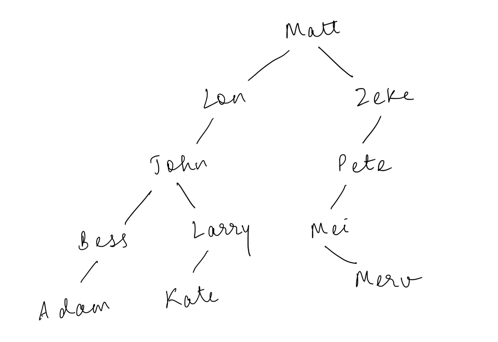
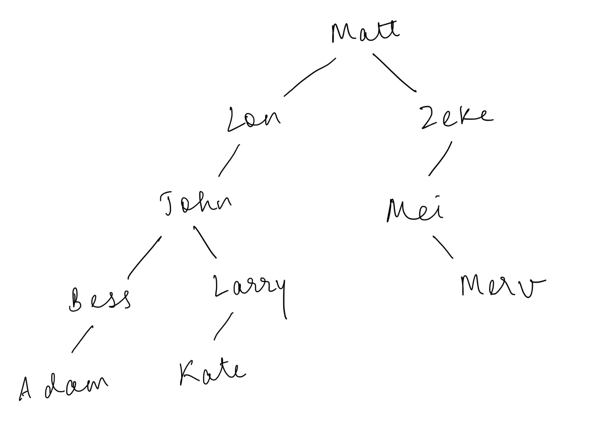
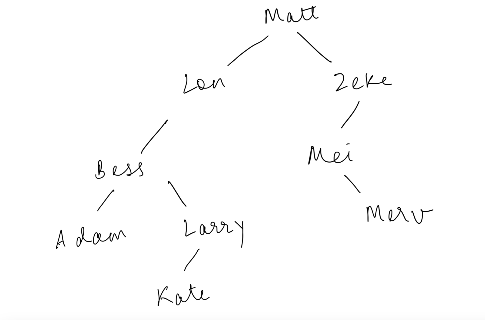
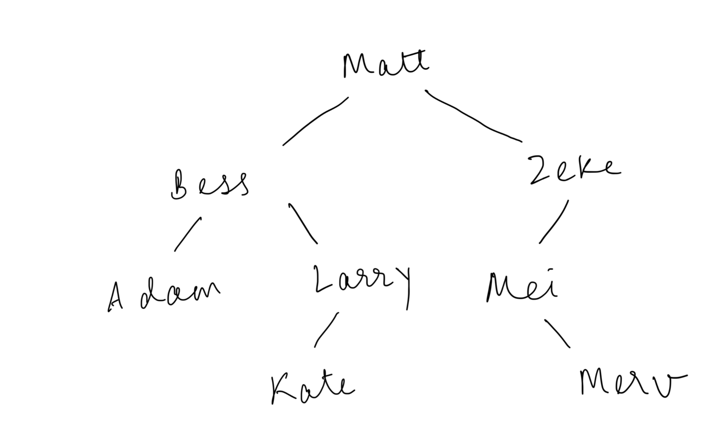
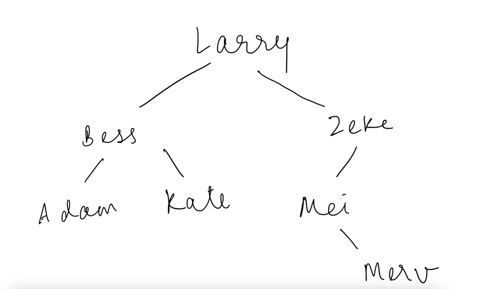

# Homework 14 - Binary Search Trees

## **Answer 1**

```java
/**
* Returns whether {@code x} is in {@code t}.
*
* @param <T>
*            type of {@code BinaryTree} labels
* @param t
*            the {@code BinaryTree} to be searched
* @param x
*            the label to be searched for
* @return true if t contains x, false otherwise
* @requires IS_BST(t)
* @ensures isInTree = (x is in labels(t))
*/
public static <T extends Comparable<T>> boolean isInTree(BinaryTree<T> t, T x) {
    boolean result;

    if (t.height() == 0){
        result = false;
    } else {
        BinaryTree<T> left = t.newInstance(), right = t.newInstance();
        T root = t.disassemble(left, right);

        int comparisonResult = x.compareTo(root);

        if (comparisonResult == 0) {
            result = true;
        } else if (comparisonResult < 0) {
            result = isInTree(left, x);
        } else {
            result = isInTree(right, x);
        }

        t.assemble(root, left, right);
    }

    return result;
}
```

---

## **Answer 2**

### **Answer 2A**



### **Answer 2B**



### **Answer 2C**



### **Answer 2D**



### **Answer 2E**


