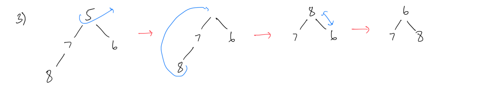

# Homework 17 - Heapsort

## **Answer 1**





---

## **Answer 2**

```java
private static boolean satisfiesHeapOrdering(BinaryTree<Integer> t) {
    if (t.size() == 0) {
        return true;
    }

    BinaryTree<Integer> left = new BinaryTree<>();
    BinaryTree<Integer> right = new BinaryTree<>();
    Integer root = t.disassemble(left, right);

    boolean isHeap = true;

    if (!left.isEmpty()) {
        isHeap = root <= left.root() && satisfiesHeapOrdering(left);
    }

    if (isHeap && !right.isEmpty()) {
        isHeap = root <= right.root() && satisfiesHeapOrdering(right);
    }

    t.assemble(root, left, right);

    return isHeap;
}
```
