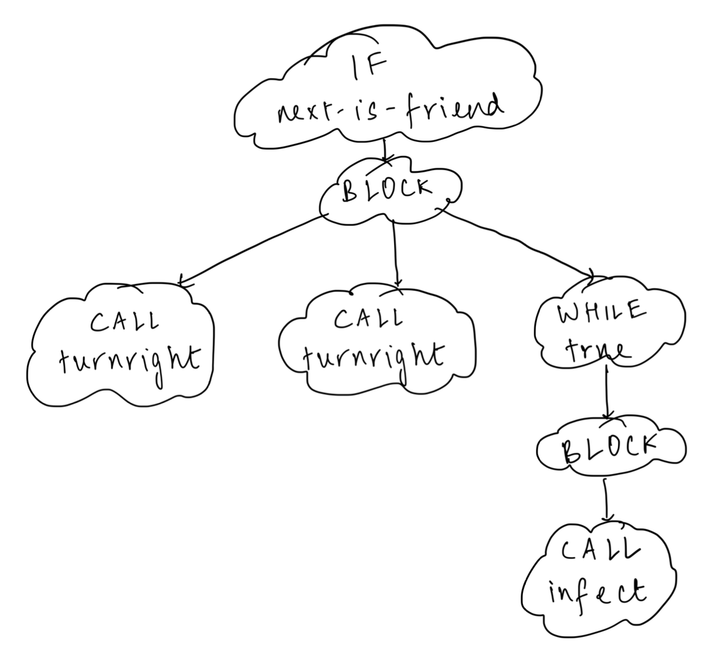

# Homework 22 - Statement and Recursion I

## **Answer 1**





---

## **Answer 2**

```java
/**
  * Reports the number of calls to primitive instructions (move, turnleft,
  * turnright, infect, skip) in a given {@code Statement}.
  *
  * @param s
  *            the {@code Statement}
  * @return the number of calls to primitive instructions in {@code s}
  * @ensures <pre>
  * countOfPrimitiveCalls =
  *  [number of calls to primitive instructions in s]
  * </pre>
  */
public static int countOfPrimitiveCalls(Statement s) {
    int count = 0;
    switch (s.kind()) {
        case BLOCK: {
            for (int i = 0; i < s.lengthOfBlock(); i++) {
                count += countOfPrimitiveCalls(s.removeFromBlock(i));
            }

            break;
        }
        case IF: {
            Statement body = s.newInstance();
            Condition cond = s.disassembleIf(body);
            count += countOfPrimitiveCalls(body);
            s.assembleIf(cond, body);

            break;
        }
        case IF_ELSE: {
            Statement thenBody = s.newInstance();
            Statement elseBody = s.newInstance();
            Condition cond = s.disassembleIfElse(thenBody, elseBody);
            count += countOfPrimitiveCalls(thenBody);
            count += countOfPrimitiveCalls(elseBody);
            s.assembleIfElse(cond, thenBody, elseBody);

            break;
        }
        case WHILE: {
            Statement body = s.newInstance();
            Condition cond = s.disassembleWhile(body);
            count += countOfPrimitiveCalls(body);
            s.assembleWhile(cond, body);

            break;
        }
        case CALL: {
            String callName = s.disassembleCall();
            if (callName.equals("move") || callName.equals("turnleft")
                    || callName.equals("turnright") || callName.equals("infect")
                    || callName.equals("skip")) {
                count = 1;
            }
            s.assembleCall(callName);

            break;
        }
        default: {
            // this will never happen...can you explain why?
            break;
        }
    }
    return count;
}
```
