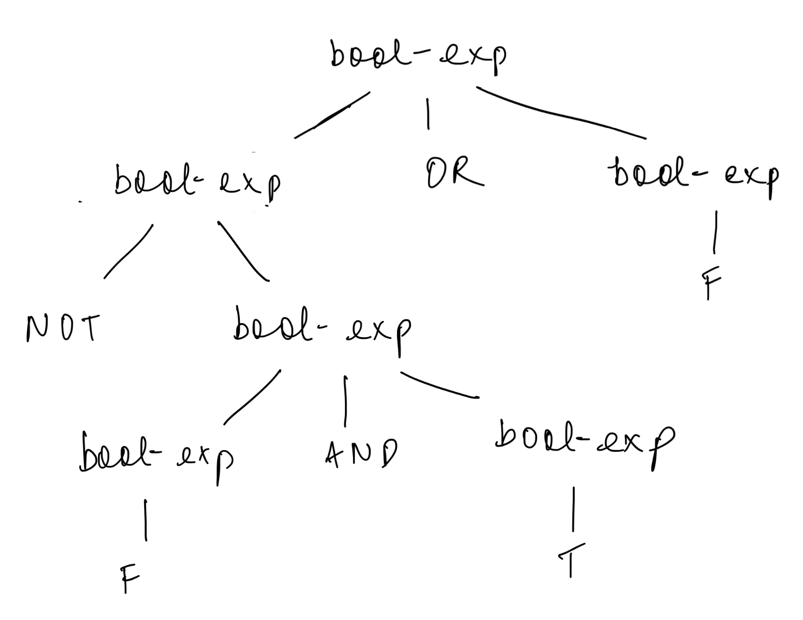

# Homework 27 - Context-Free Grammars

### Question 1

signed-real-const → sign real-const | real-const  
sign → + | -  
real-const → digit-seq . digit-seq | digit-seq . digit-seq exponent | digit-seq . | digit-seq . exponent  
exponent → E digit-seq | E + digit-seq | E - digit-seq  
digit-seq → digit digit-seq | digit  
digit → 0 | 1 | 2 | 3 | 4 | 5 | 6 | 7 | 8 | 9  

---

### Question 2

(bool-exp OR bool-exp)  
⇒ (bool-exp OR F)  
⇒ (NOT (bool-exp) OR F)  
⇒ (NOT (bool-exp AND bool-exp) OR F)  
⇒ (NOT (F AND T) OR F)  

---

### Question 3

---

### Question 4

---

### Question 5

---
